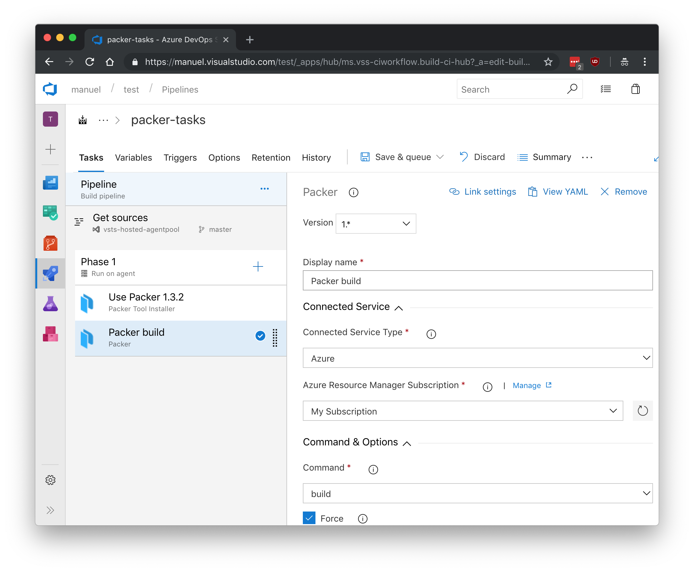

# Release Notes

> **24-07-2018**
> * Write the capture url of the VHD to the `OSDiskUri` output variable so it is accessible for downstream tasks.

# Packer Tools

Install and execute [packer](https://packer.io) as part of your build & release pipelines.

## Packer Tool

Downloads & installs specified version of packer and adds it to the tool cache.

## Packer

Execute packer commands. By selecting your Azure subcription from a service endpoint, the service principal id & key and tenant id are resolved from that and provided as variables to your packer template.